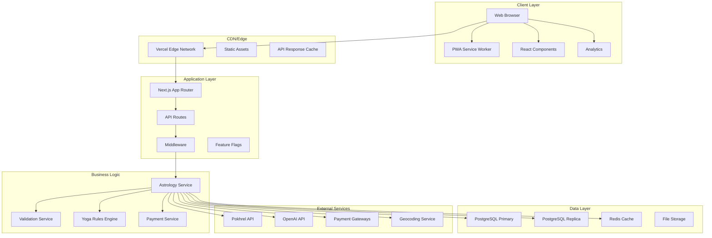
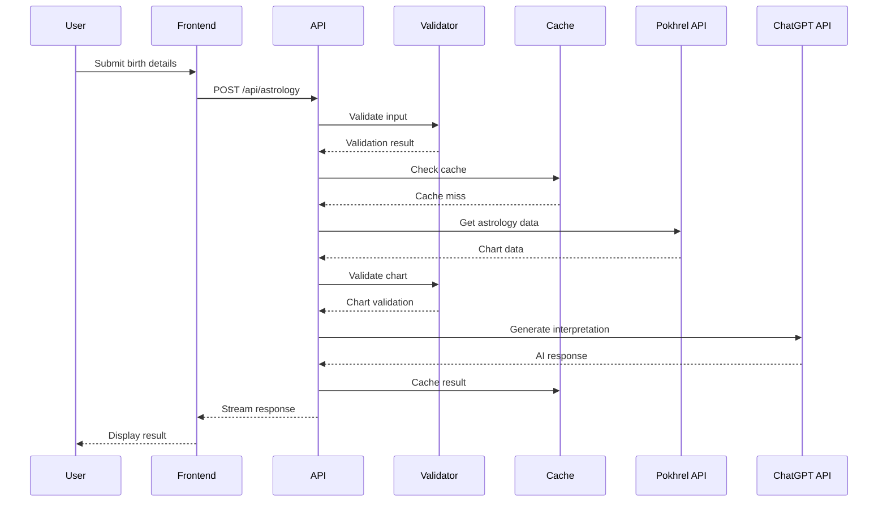
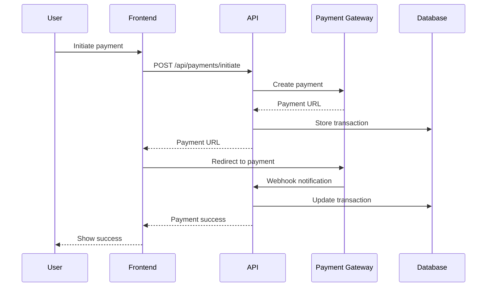

# ZSTRO AI Architecture Documentation

## Overview

ZSTRO AI is a modern, production-ready astrology platform built with Next.js 15, React 18, and TypeScript. The platform provides AI-powered Vedic astrology consultations using accurate calculations from the Pokhrel API and intelligent interpretations from ChatGPT.

## System Architecture

## Core Components

### 1. Frontend Architecture

#### Next.js App Router
- **File-based routing** with nested layouts
- **Server Components** for optimal performance
- **Client Components** for interactivity
- **Streaming** for real-time responses

#### React Components
- **Modular design** with reusable components
- **TypeScript** for type safety
- **Tailwind CSS** for styling
- **shadcn/ui** for UI components

#### PWA Features
- **Service Worker** for offline functionality
- **Web App Manifest** for installability
- **Push Notifications** for updates
- **Background Sync** for failed requests

### 2. Backend Architecture

#### API Routes
- **RESTful endpoints** for data operations
- **Streaming responses** for real-time chat
- **Rate limiting** for API protection
- **Input validation** with Zod schemas

#### Middleware
- **Authentication** with NextAuth.js
- **Rate limiting** per IP and user
- **Request logging** and monitoring
- **Security headers** and CORS

#### Business Logic
- **Astrology calculations** with Pokhrel data
- **Yoga detection** based on Vedic rules
- **Chart validation** for accuracy
- **Payment processing** with multiple gateways

### 3. Data Architecture

#### Database Design
- **PostgreSQL** as primary database
- **Read replicas** for scaling
- **Connection pooling** for performance
- **Indexes** for query optimization

#### Caching Strategy
- **Redis** for application cache
- **Memory cache** for hot data
- **CDN cache** for static assets
- **API response cache** for expensive operations

#### Data Flow
1. **User input** → Validation → Cache check
2. **Pokhrel API** → Astrology calculations
3. **Validation** → Data accuracy check
4. **ChatGPT API** → AI interpretation
5. **Response** → Cache → User

## Security Architecture

### Authentication & Authorization
- **NextAuth.js** for session management
- **JWT tokens** with encryption
- **2FA support** with TOTP
- **Role-based access** control

### Data Protection
- **Field-level encryption** for PII
- **GDPR compliance** with data retention
- **Input sanitization** and validation
- **Rate limiting** and abuse prevention

### API Security
- **HTTPS only** for all communications
- **CORS configuration** for cross-origin requests
- **Request validation** with Zod schemas
- **Error handling** without information leakage

## Performance Architecture

### Caching Strategy
- **Multi-level caching** (Memory → Redis → CDN)
- **Cache invalidation** with smart TTL
- **Edge caching** for global performance
- **API response caching** for expensive operations

### Database Optimization
- **Connection pooling** for efficient connections
- **Read replicas** for read-heavy operations
- **Query optimization** with proper indexes
- **Data partitioning** for large datasets

### Frontend Optimization
- **Code splitting** with React.lazy
- **Image optimization** with Next.js Image
- **Bundle optimization** with webpack
- **Service Worker** for offline functionality

## Monitoring & Observability

### Logging
- **Structured logging** with Pino
- **Request tracing** with unique IDs
- **Error tracking** and alerting
- **Performance metrics** collection

### Health Checks
- **Database connectivity** monitoring
- **External service** health checks
- **Cache performance** monitoring
- **API response times** tracking

### Analytics
- **User behavior** tracking
- **Performance metrics** collection
- **Error rate** monitoring
- **Business metrics** tracking

## Deployment Architecture

### Infrastructure
- **Vercel** for hosting and CDN
- **PostgreSQL** for database
- **Redis** for caching
- **Docker** for containerization

### CI/CD Pipeline
- **GitHub Actions** for automation
- **Automated testing** on PRs
- **Deployment** to staging and production
- **Rollback** capabilities

### Environment Management
- **Environment variables** for configuration
- **Feature flags** for gradual rollouts
- **Secrets management** for sensitive data
- **Configuration validation** at startup

## Scalability Considerations

### Horizontal Scaling
- **Stateless services** for easy scaling
- **Load balancing** for traffic distribution
- **Database sharding** for large datasets
- **CDN** for global content delivery

### Vertical Scaling
- **Resource optimization** for better performance
- **Connection pooling** for database efficiency
- **Memory management** for large datasets
- **CPU optimization** for calculations

### Performance Targets
- **API response time** < 400ms (cached), < 900ms (cold)
- **Page load time** < 2.5s on 4G mid-tier
- **Cache hit rate** > 80%
- **Uptime** > 99.9%

## Data Flow Diagrams

### Astrology Consultation Flow

### Payment Flow

## Error Handling Strategy

### Error Types
1. **Validation errors** - User input issues
2. **Business logic errors** - Application rules
3. **External service errors** - API failures
4. **System errors** - Infrastructure issues

### Error Handling Flow
1. **Catch** error at appropriate level
2. **Log** error with context
3. **Transform** to user-friendly message
4. **Return** appropriate HTTP status
5. **Monitor** error rates and patterns

### Recovery Strategies
- **Retry** with exponential backoff
- **Fallback** to cached data
- **Circuit breaker** for failing services
- **Graceful degradation** for non-critical features

## Testing Strategy

### Unit Tests
- **Jest** for JavaScript/TypeScript
- **Testing Library** for React components
- **Mocking** for external dependencies
- **Coverage** > 80% for critical paths

### Integration Tests
- **API endpoints** testing
- **Database** integration
- **External services** mocking
- **End-to-end** workflows

### E2E Tests
- **Playwright** for browser automation
- **User journeys** testing
- **Cross-browser** compatibility
- **Performance** testing

## Future Enhancements

### Planned Features
- **Mobile app** with React Native
- **Advanced visualizations** with 3D charts
- **Voice input** for questions
- **Multi-language** support

### Technical Improvements
- **Microservices** architecture
- **Event-driven** communication
- **Machine learning** integration
- **Real-time** collaboration

### Scalability Improvements
- **Kubernetes** orchestration
- **Service mesh** for communication
- **Event streaming** with Kafka
- **Global** multi-region deployment

## Conclusion

The ZSTRO AI architecture is designed for scalability, performance, and maintainability. The modular design allows for easy extension and modification while maintaining high standards for security and user experience. The comprehensive testing strategy ensures reliability, and the monitoring setup provides visibility into system health and performance.

---

*Last Updated: January 2024*
*Version: 1.0.0*
